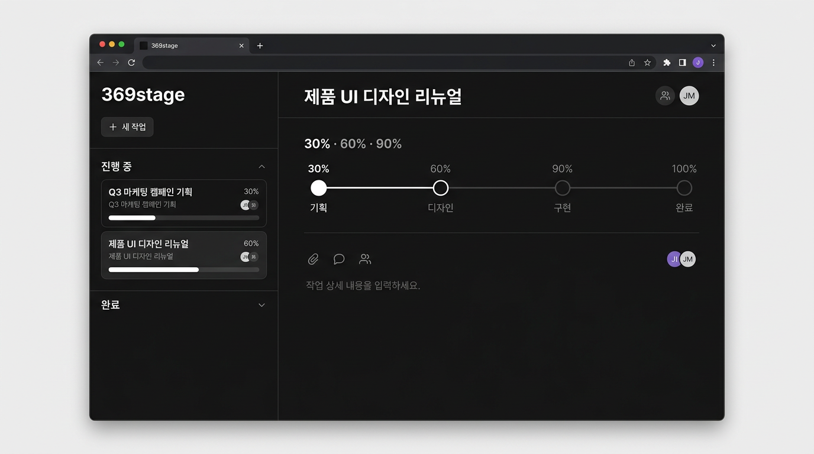
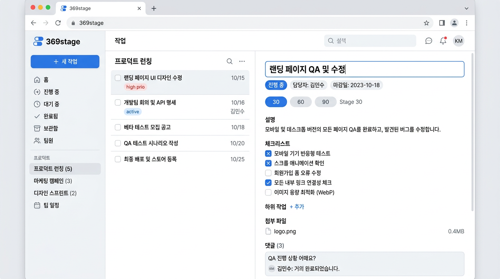

# 369stage

30 / 60 / 90 단계로 작업을 나누고, **90% 단계의 체크리스트**를 모두 통과한 뒤에만 완료로 넘어가는 셀프 컨펌용 태스크 앱입니다.

## 스크린샷

생성형 목업 이미지입니다. 실제 UI와 레이아웃·문구가 조금 다를 수 있습니다. 정확한 화면은 `npm run dev`로 확인하세요.

| 다크 | 라이트 |
|------|--------|
|  |  |

## 기술 스택

- **프론트:** React 19, TypeScript, Vite 8, Tailwind CSS v4, Zustand
- **스타일:** 라이트/다크 테마 토글 (`ThemeProvider`)
- **저장:** 원격 미설정 시 브라우저 `localStorage` (`369stage-tasks`) · 원격 설정 시 Cloudflare Worker API (`GET/PUT /tasks`)

## 빠른 시작

```bash
npm install
npm run dev
```

브라우저에서 Vite가 안내하는 주소(보통 `http://localhost:5173`)로 접속합니다.

## 원격 API 연결 (선택)

`VITE_API_URL`과 `VITE_API_SECRET`이 **둘 다** 있으면 `localStorage` 대신 Worker와 동기화합니다.

프로젝트 루트에 `.env.local`을 만들고 예시는 다음과 같습니다.

```env
VITE_API_URL=https://your-worker.workers.dev
VITE_API_SECRET=Cloudflare에_wrangler_secret_put으로_등록한_값과_동일
```

- 비밀은 **클라이언트 번들에 포함**되므로 공개 저장소에 올리지 말고, `.env.local`은 커밋하지 않습니다.
- 값을 바꾼 뒤에는 **`npm run dev`를 다시 실행**해야 반영됩니다.

## API 응답·요청 형식

베이스 URL은 `VITE_API_URL` 값입니다. 경로는 **`/tasks`** 하나만 사용합니다.

### 인증

모든 요청에 아래 헤더가 필요합니다. Worker 쪽 `API_SECRET`과 동일한 문자열을 씁니다.

```http
Authorization: Bearer <VITE_API_SECRET>
```

### `GET /tasks`

**성공 (200):** JSON 객체. 클라이언트는 `tasks` 배열만 사용하며, 없거나 배열이 아니면 빈 배열로 취급합니다.

```json
{
  "tasks": [
    {
      "id": "uuid-or-string",
      "title": "제목",
      "description": "설명",
      "status": "active",
      "currentStage": 30,
      "checklist": [
        { "id": "item-1", "text": "할 일", "checked": false }
      ]
    }
  ]
}
```

| 필드 | 타입 | 설명 |
|------|------|------|
| `tasks` | 배열 | 각 원소는 **Task** (아래 스키마). 생략 시 `[]`로 처리 |

**실패:** `4xx` / `5xx` — 클라이언트는 본문을 파싱하지 않고 상태 코드만 사용합니다.

### `PUT /tasks`

**요청 본문:** JSON 객체. 전체 목록을 한 번에 덮어씁니다.

```http
Content-Type: application/json
```

```json
{
  "tasks": [ /* Task[] — GET과 동일한 형태 */ ]
}
```

**성공:** `2xx` (본문은 사용하지 않음)

**실패:** `4xx` / `5xx`

### Task 스키마 (클라이언트 기준)

| 필드 | 타입 | 필수 | 설명 |
|------|------|------|------|
| `id` | `string` | ✓ | 고유 ID |
| `title` | `string` | ✓ | 제목 |
| `description` | `string` | ✓ | 설명 (빈 문자열 가능) |
| `status` | `'active' \| 'done'` | ✓ | 진행 중 / 완료 |
| `currentStage` | `30 \| 60 \| 90` | ✓ | 현재 단계(%) |
| `checklist` | 배열 | ✓ | 90% 완료 게이트용 항목들 |

`checklist` 항목:

| 필드 | 타입 | 설명 |
|------|------|------|
| `id` | `string` | 항목 ID |
| `text` | `string` | 표시 문구 |
| `checked` | `boolean` | 체크 여부 |

**레거시:** 예전에 `checklist`가 `{ "30": [...], "90": [...] }` 형태였던 데이터는 클라이언트가 불러올 때 **90 키 배열만** 끌어와 평탄화합니다. 신규 저장은 항상 **배열** 형태입니다.

## 스크립트

| 명령 | 설명 |
|------|------|
| `npm run dev` | 로컬 개발 서버 |
| `npm run build` | TypeScript 검사 + 프로덕션 빌드 (`dist/`) |
| `npm run lint` | ESLint |
| `npm run preview` | 빌드 후 Wrangler로 프리뷰 (설정에 따라 동작) |
| `npm run deploy` | 빌드 후 `wrangler deploy` (Cloudflare 설정 필요) |

## 프로젝트 구조 (요약)

```
src/
  components/     # UI (사이드바, 상세, 모달, 스테퍼, 테마 토글 등)
  lib/            # API 클라이언트, 게이트 로직
  store/          # Zustand 스토어, 원격 동기화, 마이그레이션
  theme/          # 테마 Context
  types/          # Task, 단계 타입
```

## 도메인 규칙 (요약)

- **단계:** 30 → 60 → 90, `다음 단계로`는 체크리스트 없이 진행 가능합니다.
- **완료:** 90%에서 체크리스트가 1개 이상이고 전부 체크된 경우에만 `작업 완료`가 가능합니다.
- **상태:** `active` / `done`

## 알려진 제한·개선 포인트

- **동기화:** 원격 모드는 전체 `tasks` 배열을 `PUT`으로 저장합니다. 탭을 두 개 켜 두면 마지막 저장이 이깁니다.
- **보안:** `VITE_API_SECRET`은 브라우저에 노출됩니다. 개인·저위험 용도를 전제로 한 설계입니다.
- **원격 불러오기 실패:** 첫 `GET`이 실패하면 자동 저장을 하지 않아, 빈 목록으로 서버를 덮지 않도록 했습니다. UI에 안내 배너가 뜹니다.
